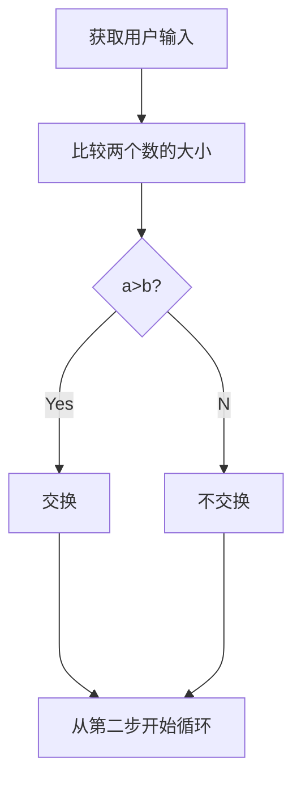

# 414join
This is a answer.
你好，我是范熙来。我是数技22级的新生，来自内蒙古。
想在大一这一年中尽可能多的接触 学习一些技术和软件，拓展自己的学习途径，达到入门的水平，并且可以参与到一些项目当中，尽快找到自己喜欢的某一方向。
 [Image text](Screenshots/001)

```mermaid
flowchart TD
A[获取用户输入]-->B[比较两个数的大小];
B-->C{a>b?};
C--Yes-->D[交换];
C--No-->E[不交换];
D---->H[从第二步开始循环];
E---->H[从第二步开始循环];
```
